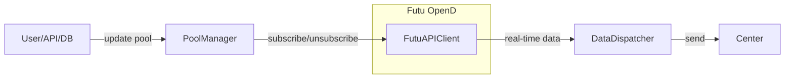

Absolutely! Let’s discuss the architecture and design considerations for a system that maintains a dynamic pool of stocks to subscribe to via the Futu OpenAPI, and continuously sends real-time data back to a central “center” (which could be a server, database, message queue, etc.).

---

## 1. **Core Requirements**

- **Dynamic Pool:**The system should be able to add/remove stock codes from the subscription pool at runtime.
- **Subscription Management:**Efficiently manage Futu OpenAPI subscriptions, respecting API limits and avoiding redundant/unnecessary subscriptions.
- **Data Forwarding:**Upon receiving real-time data, forward it to a central destination (“center”) reliably and efficiently.
- **Resilience:**Handle reconnections, API errors, and ensure data is not lost during transient failures.
- **Scalability:**
  Support a large and changing set of stock codes, possibly with sharding or batching if needed.

---

## 2. **Key Design Components**

### A. **Subscription Pool Manager**

- **Responsibilities:**
  - Maintain the current set of stock codes to subscribe to.
  - Add/remove codes as requested (possibly via API, config file, or database).
  - Track which codes are currently subscribed.
  - Handle Futu API subscription/unsubscription calls.
- **Implementation:**
  - Use a thread-safe data structure (e.g., set or dict) to store the pool.
  - Optionally, persist the pool state for recovery after restarts.

### B. **Futu OpenAPI Client**

- **Responsibilities:**
  - Connect to Futu OpenD.
  - Subscribe/unsubscribe to stock codes as directed by the pool manager.
  - Receive real-time data via callbacks/handlers.
- **Implementation:**
  - Use the official Futu API Python SDK.
  - Implement custom handlers for different data types (e.g., quotes, order book).

### C. **Data Dispatcher**

- **Responsibilities:**
  - Upon receiving data from Futu, forward it to the “center”.
  - Handle batching, retries, and error handling.
- **Implementation:**
  - Could be as simple as an HTTP POST, message queue (Kafka, RabbitMQ), or database insert.
  - Consider async processing for high throughput.

### D. **Central “Center”**

- **Responsibilities:**
  - Receive and process/store the real-time data.
  - Could be a REST API, message broker, or database endpoint.

---

## 3. **Workflow Example**

1. **Initialization:**

   - System starts, loads initial stock pool (from config, DB, or API).
   - Connects to Futu OpenD and subscribes to all codes in the pool.
2. **Dynamic Updates:**

   - When a new stock code is added, the pool manager subscribes to it via Futu API.
   - When a code is removed, the pool manager unsubscribes.
3. **Data Handling:**

   - Futu API client receives real-time data via callback.
   - Data dispatcher forwards the data to the center.
4. **Resilience:**

   - On connection loss, system attempts to reconnect and re-subscribe as needed.
   - Errors in data dispatching are logged and retried.

---

## 4. **Discussion Points / Questions for You**

- **How is the pool updated?**
  - Manually (via CLI/API), or automatically (from a DB, config, or external service)?
  - A: via CLI/API is the basic, other thing can leave to the future
- **What is the “center”?**
  - Is it a REST API, message queue, database, or something else?
  - at least a datbase, and maybe other callback funtions that can be trigger based on some rules, e.g. a sudden quote change
- **What data types do you need?**
  - Quotes, order book, ticks, etc.?
  - Quotes, order book,
- **How many stocks do you expect to track simultaneously?**
  - This affects batching, sharding, and API quota management.
  - 950 for normal tracking (large company, or user selected), and 50 for spare, when a new event happens, need to start tracking right away, (unsubcribe the 950) (the number can be up or down)
- **What are your reliability and latency requirements?**
  - Is it okay to lose some data, or must every tick be delivered?
  - it is okay to lose some data, quick and correct are priority
- **Do you need to persist the pool state?**
  - For recovery after crashes/restarts.
  - yes

---

## 5. **Example High-Level Architecture Diagram**

---

**Let’s clarify your requirements and preferences on the above points before we move to code.**
What are your thoughts, and do you have answers to the questions above?
